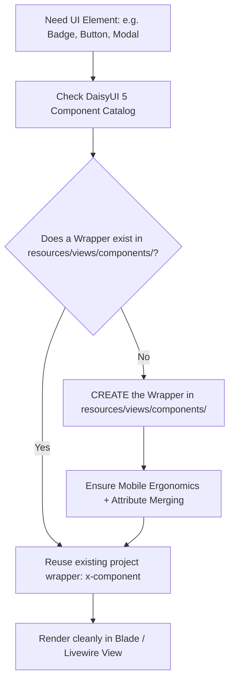

# DaisyUI 5 Components & Project Wrapper Architecture

**CRITICAL MANDATE:** In this project, UI development is standardized around **DaisyUI 5** (integrated with Tailwind CSS v4). Every agent and developer MUST follow two foundational laws:

1. **DaisyUI-First Strategy:** Always prioritize DaisyUI components before inventing custom HTML or writing utility soup classes.
2. **Mandatory Project Wrapper:** NEVER use raw DaisyUI classes directly in page views, layouts, or Livewire components. Every DaisyUI component MUST be encapsulated in a reusable project Blade component under `resources/views/components/`.

---

## 1. The Two Golden Rules

### Rule 1: Always Check DaisyUI First
Before building any visual element (button, input, card, badge, modal, alert, toggle, drawer, table, dropdown, tabs, collapse, avatar), check DaisyUI's component library.
- DaisyUI provides accessible, semantically styled components (`btn`, `input`, `card`, `badge`, `modal`, `alert`, `toggle`, `drawer`, etc.).
- Do not build custom button styles like `bg-indigo-600 hover:bg-indigo-700 px-4 py-2 text-white rounded-xl shadow...` when DaisyUI provides `btn btn-primary`.

### Rule 2: Strict Project Wrapper Requirement
**Under no circumstances may an agent inject raw DaisyUI classes directly into page templates or Livewire views.**

❌ **FORBIDDEN (Raw DaisyUI in views):**
```blade
{{-- In resources/views/dashboard.blade.php or any view --}}
<button class="btn btn-primary btn-sm min-h-[44px]">Guardar</button>
<div class="card bg-base-100 shadow-xl p-4">...</div>
<input type="text" class="input input-bordered w-full" />
```

✅ **REQUIRED (Using Project Wrapper Components):**
```blade
{{-- In resources/views/dashboard.blade.php or any view --}}
<x-button variant="primary" size="sm">Guardar</x-button>
<x-card title="Detalles">...</x-card>
<x-input name="email" label="Correo Electrónico" wire:model="email" />
```

---

## 2. Component Creation Workflow

Whenever you need a UI element in any view or Livewire component:



1. **Identify the Needed Component:** Determine the appropriate DaisyUI 5 component (e.g. `badge`, `modal`, `select`).
2. **Inspect Existing Wrappers:** Check `resources/views/components/` to see if a wrapper already exists.
3. **If Wrapper Exists:** Consume it directly using `<x-[name]>`.
4. **If Wrapper Does NOT Exist:**
   - Create a new Blade component in `resources/views/components/[name].blade.php`.
   - Encapsulate the DaisyUI classes, variants, and sizes inside the wrapper using `@props` and `$attributes->class()`.
   - Include mobile-first ergonomics (e.g., `min-h-[44px]`, `active:scale-95`).
   - Use the newly created wrapper in your view.

---

## 3. Anatomy of a Compliant DaisyUI Wrapper

Every wrapper in `resources/views/components/` MUST adhere to these architectural standards:

### 3.1 Attribute Merging (`$attributes->class()`)
Always allow calling views to pass extra classes, HTML attributes, `wire:click`, `wire:model`, `x-data`, etc., without breaking the component:

```blade
@props([
    'variant' => 'primary',
    'size' => 'md',
])

@php
$baseClasses = 'btn active:scale-95 transition-all select-none';

$variantClasses = match($variant) {
    'primary'   => 'btn-primary',
    'secondary' => 'btn-secondary',
    'neutral'   => 'btn-neutral',
    'ghost'     => 'btn-ghost',
    'danger'    => 'btn-error',
    'outline'   => 'btn-outline',
    default     => 'btn-primary',
};

$sizeClasses = match($size) {
    'xs' => 'btn-xs',
    'sm' => 'btn-sm',
    'lg' => 'btn-lg',
    default => 'btn-md min-h-[44px]',
};
@endphp

<button {{ $attributes->class([$baseClasses, $variantClasses, $sizeClasses]) }}>
    {{ $slot }}
</button>
```

### 3.2 Mobile-First & Capacitor Ergonomics
In accordance with `mobile-capacitor-views`:
- Interactive elements (buttons, inputs, clickable cards) must have a minimum touch target of `44px` (`min-h-[44px]`).
- Provide instantaneous tactile feedback using `active:scale-95` or `active:opacity-80`.
- Add `select-none` on interactive elements to prevent accidental OS text selection in mobile WebViews.

### 3.3 Livewire & Alpine.js Compatibility
- Never hardcode element IDs that collide with Livewire's DOM diffing.
- Always pass `$attributes` through to the root interactive element to preserve directives like `wire:model`, `wire:click`, `wire:loading.attr="disabled"`.

---

## 4. Standard Project Wrapper Inventory & Specifications

The standard components located in `resources/views/components/`:

### `<x-button>`
- **DaisyUI Core:** `btn`, `btn-primary`, `btn-secondary`, `btn-neutral`, `btn-ghost`, `btn-error`, `btn-outline`
- **Props:**
  - `variant`: `primary` (default), `secondary`, `neutral`, `ghost`, `danger`, `outline`
  - `size`: `xs`, `sm`, `md` (default), `lg`
  - `type`: `button` (default), `submit`, `reset`
  - `loading`: boolean (displays DaisyUI loading spinner `loading loading-spinner`)
  - `icon`: slot or inline SVG
- **Usage:**
  ```blade
  <x-button variant="primary" type="submit">
      Guardar Cambios
  </x-button>

  <x-button variant="ghost" size="sm" wire:click="refresh">
      Recargar
  </x-button>
  ```

### `<x-input>`
- **DaisyUI Core:** `input`, `input-bordered`, `input-error`, `validator`
- **Props:**
  - `name`: string
  - `label`: optional string
  - `type`: string (default `'text'`)
  - `error`: optional string (or auto-detected via Laravel's `$errors`)
  - `hint`: optional helper text
  - `size`: `sm`, `md`, `lg`
- **Usage:**
  ```blade
  <x-input
      name="email"
      label="Correo Electrónico"
      type="email"
      placeholder="tu@correo.com"
      wire:model="email"
  />
  ```

### `<x-card>`
- **DaisyUI Core:** `card`, `card-body`, `card-title`, `card-actions`
- **Props:**
  - `title`: optional string (or slot)
  - `bordered`: boolean (default `true`)
  - `compact`: boolean (default `false`)
- **Slots:**
  - `$slot`: Main body content
  - `$actions`: Optional card footer actions
- **Usage:**
  ```blade
  <x-card title="Información de Usuario" bordered>
      <p class="text-zinc-400">Detalles de la cuenta activa.</p>
      <x-slot:actions>
          <x-button variant="primary" size="sm">Editar</x-button>
      </x-slot:actions>
  </x-card>
  ```

### `<x-badge>`
- **DaisyUI Core:** `badge`, `badge-primary`, `badge-secondary`, `badge-success`, `badge-warning`, `badge-error`, `badge-outline`
- **Props:**
  - `variant`: `neutral` (default), `primary`, `secondary`, `success`, `warning`, `error`, `ghost`
  - `size`: `xs`, `sm`, `md` (default), `lg`
  - `outline`: boolean (default `false`)
- **Usage:**
  ```blade
  <x-badge variant="success" size="sm">Activo</x-badge>
  <x-badge variant="warning" outline>Pendiente</x-badge>
  ```

### `<x-alert>`
- **DaisyUI Core:** `alert`, `alert-info`, `alert-success`, `alert-warning`, `alert-error`
- **Props:**
  - `type`: `info` (default), `success`, `warning`, `error`
  - `dismissible`: boolean (default `false`)
- **Usage:**
  ```blade
  <x-alert type="success">
      ¡Operación completada con éxito!
  </x-alert>
  ```

### `<x-modal>`
- **DaisyUI Core:** `modal`, `modal-box`, `modal-action`, `<dialog>`
- **Props:**
  - `id`: unique modal identifier
  - `title`: modal title
  - `open`: boolean (for Alpine / Livewire state binding)
- **Slots:**
  - `$slot`: modal body
  - `$actions`: action buttons inside `modal-action`

---

## 5. Summary Checklist for Every UI Task

Before completing any UI change, verify:
- [ ] Did you check if DaisyUI 5 has a component for this element?
- [ ] Is there **zero** raw DaisyUI class usage in page views / Livewire templates?
- [ ] Does every DaisyUI element use a wrapper from `resources/views/components/`?
- [ ] If a wrapper did not exist, did you create it in `resources/views/components/` first?
- [ ] Does the wrapper support `$attributes->class()` merging?
- [ ] Does the wrapper adhere to mobile touch guidelines (`min-h-[44px]` on interactive controls)?
